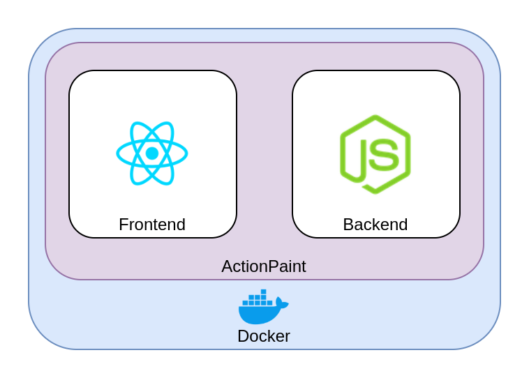
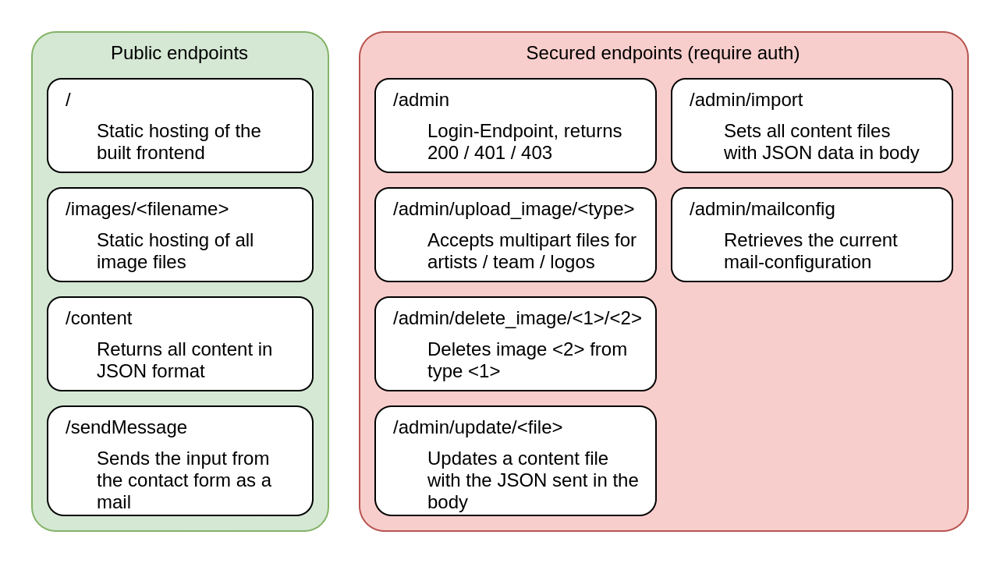
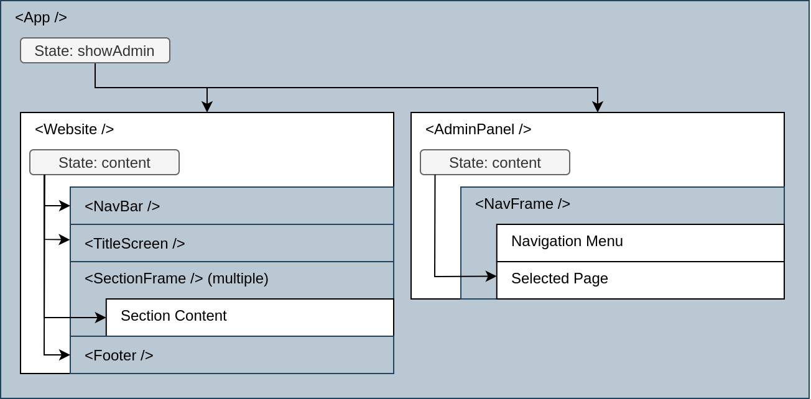

# ActionPaint

A website for a fictional artist agency called ActionPaint. It's been realized as a react page with a node + express backend.

Going beyond the initial requirements the page was made fully configurable via a password protected admin interface, hence expanding the scope of use to being a template for a website with any content. While it's currently configured to display some example data from the fictional company, it can be adapted to several scenarios.

Despite this being "only" a student project, a great deal of attention was paid to create clean and good code, following the standards and conventions for React / NodeJS applications. This should alllow you to understand the code without great effort and enable you to make your own modifications, should you be interested in using this template.

While this repository is not being actively developed anymore and mainly serves the purpose of code preservation, contributions are welcome.

# Deployment

There's a docker image available which runs a server hosting both front- and backend.

Pull from docker hub

```
docker pull f1nnm/actionpaint
```

Pull from github repository

```
docker pull ghcr.io/f1nnm/actionpaint
```

Server is exposed at port 4000.

A simple command to quickly try it out: 

```
docker run -p80:4000 -it f1nnm/actionpaint:latest
```

or

```
docker run -p80:4000 -it ghcr.io/f1nnm/actionpaint:latest
```

For production a bit more configuration is needed:

## Configuration
The admin panel needs to be configured over environment variables:

Following variables need to be set:
```bash
# admin user
ADMIN_USER='admin'
ADMIN_PASS='secretpassword'
```

Should backend and frontend run on different ports/(sub)domains, the variable `ALLOW_CORS` has to be set to true.

The content and the settings for the contact from then can be set via the admin GUI, accessible with the above defined username/password.

# Architecture

As mentioned above, the website comes with its own server for the backend, packed into a Docker container.


At build time the compiled frontend is placed into a folder accessible by the backend, which allows it to function as a basic webserver for those files.

## Backend / Frontend communication

Once the frontend has been loaded by the client, it will request the actual content and styling. Loading the content like this, and not compiling it in allows for very rapid changes to the settings, as they don't require the entire website to be recompiled.

The admin interface simply talks to a REST API in the backend to update image files or .JSON files containing content and styling. All available endpoints are listed here:



Authentication is, for convenience sake, done via simple HTTP-Auth, checked against a username / password provided to the server via environment variables.
While this is not the most secure option out there, it offers sufficient protection for a simple website like this, not handling any critical data, provided it's being served over HTTPS.

## Frontend

The basic "layout" of the React components is as follows:



The all-encompasing app contains a state to switch between rendering the actual website or the admin panel. Each of those components loads the current settings and the content from the backend. Additinally to the public content loaded by the website component, the adminpanel also loads more secret configurations, as the access data to the mail server, used for the contact form.
